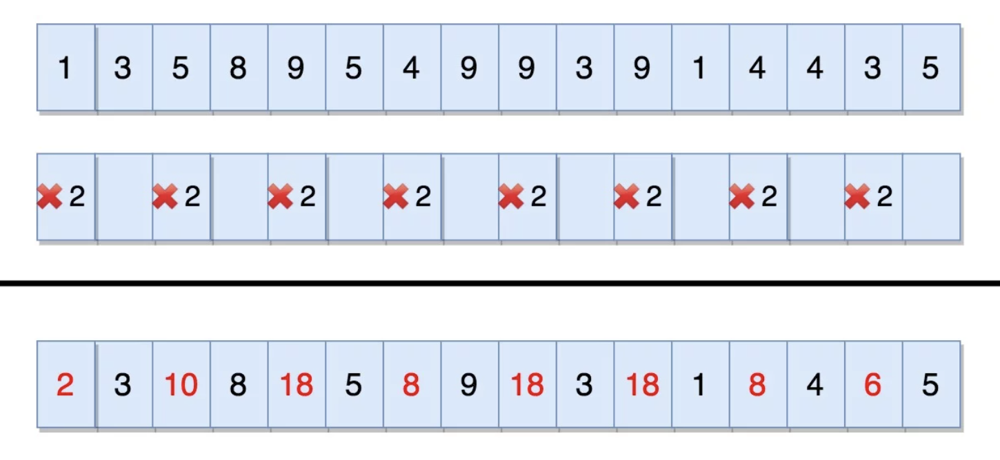
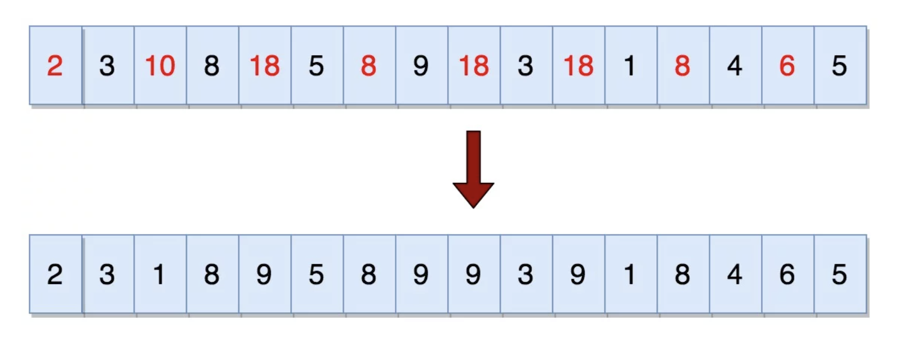
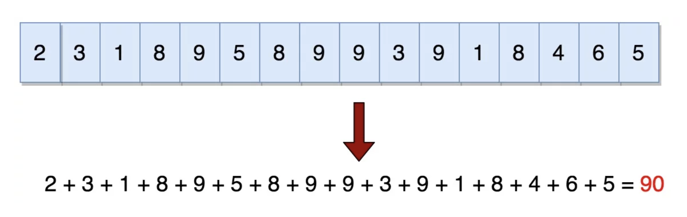
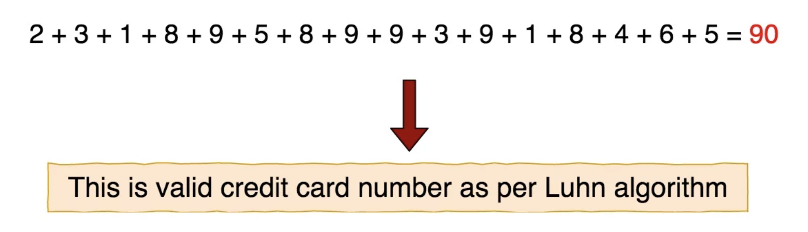

Heres my first attempt at solving a task using Go which I have begun to learn.

EXCERSISE:

The Luhn algorithm is used to validate a variety of identification numbers, such as credit card numbers.

Write a program that takes a credit card number as an input and performs verification by implementing the Luhn algorithm. The program should output either VALID or INVALID.

 

### - Step 1 ### 

From the rightmost digit, you must double every second digit.

 

### - Step 2 ### 

When you double the digits and get the product in double digits, then you must add the digits of the product.

 

### - Step 3 ### 

Compute the sum of all the digits.

### - Step 4 ### 

If the total sum is divisible by 10, then the number is valid otherwise it is not valid.

 
 

Useful link to aid testing - https://www.freeformatter.com/credit-card-number-generator-validator.html

 